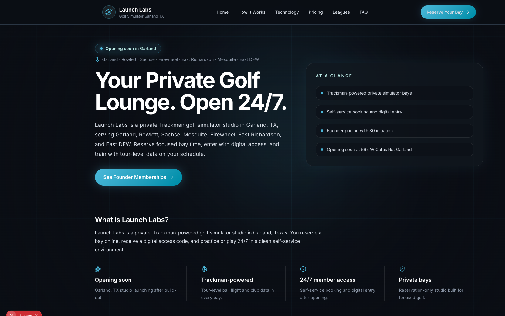
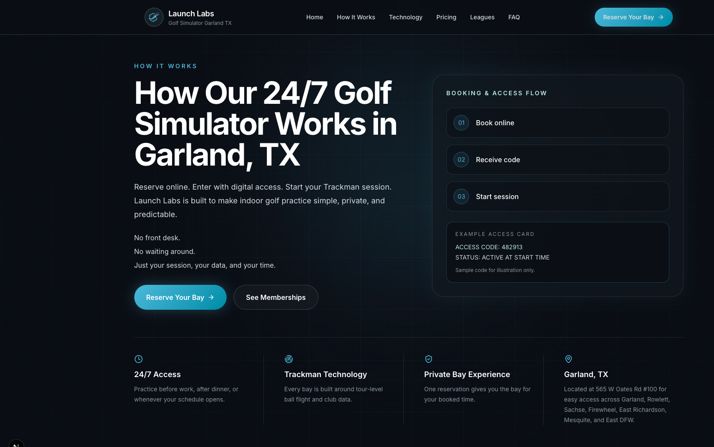
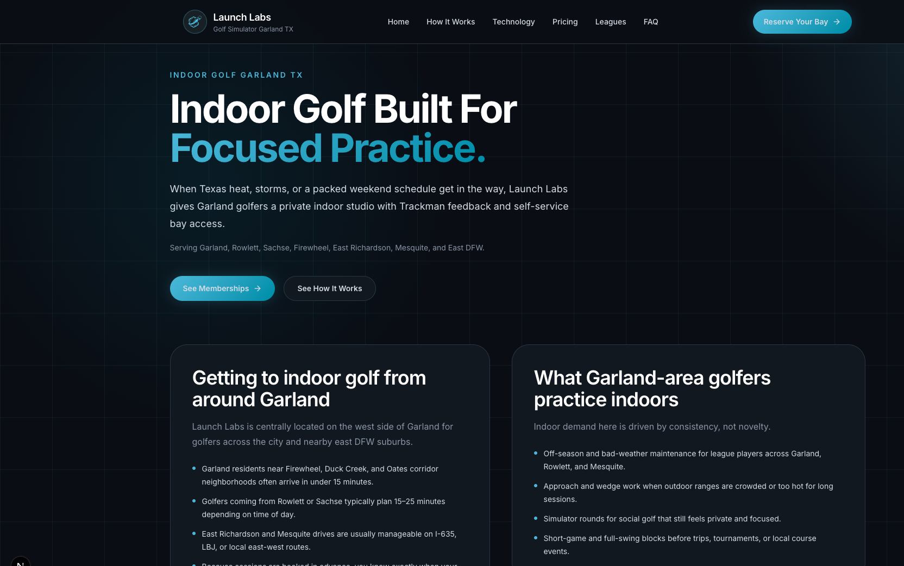
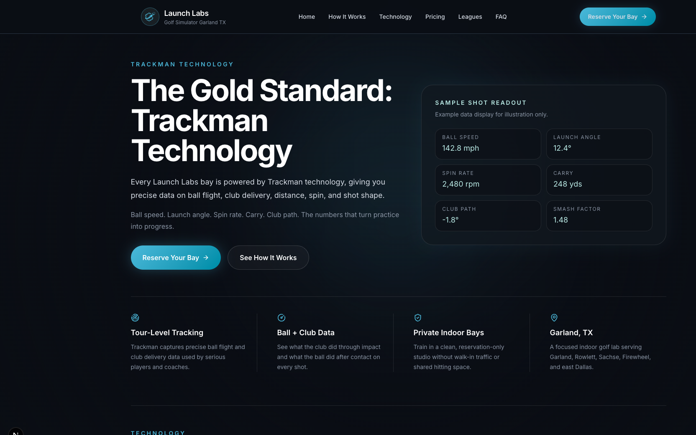

# Launch Labs Website / Product Build

Indoor golf performance facility concept built for golfers in the Garland / Rowlett / Sachse / Firewheel area.

**Live demo:** _Add Vercel URL after deploy (see [Publish](#publish) below)_

**Production site:** [launchlabstx.com](https://launchlabstx.com)

**Portfolio case study (public GitHub):** [docs/CASE_STUDY.md](docs/CASE_STUDY.md)

**Deployment:** Full website source stays local/private. Vercel production is deployed separately — not from public GitHub.

---

## Project Overview

I led the product, brand, website, membership structure, and go-to-market execution for Launch Labs — a private, Trackman-powered indoor golf studio opening in Garland, TX.

## My Role

- Product strategy
- Website rebuild planning and implementation
- Membership and pricing structure
- SEO and content positioning
- CRM and lead funnel planning
- Social media launch strategy
- Customer terms and policy development

## Tech Stack

| Layer | Tools |
|---|---|
| Frontend | Next.js 16, React 19, TypeScript, Tailwind CSS 4 |
| SEO | JSON-LD schema, sitemap, robots.txt, llms.txt, local landing pages |
| Content | Centralized site config, pricing data, service-area page system |
| Icons | Lucide React |

**Also used in the broader launch:** GoHighLevel CRM, Canva brand design, Google Sheets content calendar, email/SMS campaigns.

## Key Outcomes

- Founding membership campaign with scarcity tracking and CTA flow
- Pricing and membership structure (Player / VIP founder tiers, feature matrix)
- Multi-page marketing site with conversion-focused landing pages
- SEO architecture: core pages, local service-area pages, FAQ schema
- Legal pages: terms of service, privacy policy, liability waiver
- Automated-friendly content structure (`llms.txt`, structured data)

## Screenshots

### Home (desktop)



### Home (mobile)


### Pricing / founding memberships



### How it works


### Local SEO landing page



### Trackman technology



## Site Map

| Route | Description |
|---|---|
| `/` | Home — hero, founder memberships, FAQ preview |
| `/pricing` | Membership tiers, feature matrix, billing notes |
| `/how-it-works` | Booking flow, first-visit guide, bay etiquette |
| `/technology` | Trackman iO positioning and data metrics |
| `/faq` | Full FAQ accordion |
| `/golf-simulator-garland-tx` | Primary local SEO page |
| `/indoor-golf-garland-tx` | Indoor golf local landing |
| `/trackman-golf-simulator-garland-tx` | Trackman-specific local landing |
| `/golf-league-garland-tx` | League interest capture |
| `/rowlett`, `/mesquite` | Nearby city landing pages |

## Local Setup

```bash
npm install
npm run dev
```

Open [http://localhost:3000](http://localhost:3000).

```bash
npm run build   # production build
npm run lint    # ESLint
```

## Publish

The site is committed locally on `main`. To push to GitHub:

1. Create a **public** repo named `launch-labs-product-build` at [github.com/new](https://github.com/new) (no README, license, or `.gitignore`).
2. Authenticate with GitHub (`gh auth login` or a [Personal Access Token](https://github.com/settings/tokens)).
3. Push from this repo (remote already points at `Xander-Le/launch-labs-product-build`):

```bash
git push -u origin main
```

If you need to re-add the remote:

```bash
git remote set-url origin https://github.com/Xander-Le/launch-labs-product-build.git
git push -u origin main
```

### Deploy to Vercel (recommended)

1. Import the GitHub repo at [vercel.com/new](https://vercel.com/new).
2. Use the Next.js defaults (no env vars required).
3. After deploy, add the `*.vercel.app` URL to the **Live demo** line at the top of this README.

## Notes

Sensitive business data, customer information, and internal financial details are excluded from this repository. Public-facing marketing copy, membership pricing, and business contact information reflect the live Launch Labs brand.
